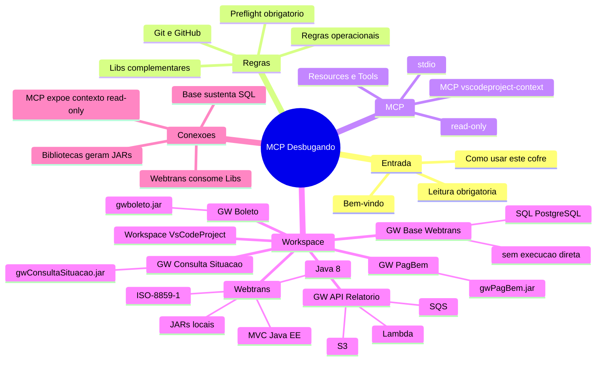

---
tags:
  - mapa
  - obsidian
  - mcp
aliases:
  - Mind map
---

# Mapa mental

## Links do mapa

- [[Bem-vindo]]
- [[Como usar este cofre]]
- [[Leitura obrigatoria]]
- [[Preflight obrigatorio]]
- [[Regras operacionais]]
- [[Git e GitHub]]
- [[Libs complementares]]
- [[MCP vscodeproject-context]]
- [[Resources e Tools]]
- [[Workspace VsCodeProject]]
- [[Webtrans]]
- [[GW Base Webtrans]]
- [[GW Boleto]]
- [[GW Consulta Situacao]]
- [[GW PagBem]]
- [[GW API Relatorio]]

## Leitura visual

- O nucleo do cofre e [[Preflight obrigatorio]].
- [[Regras operacionais]] define como agir.
- [[Git e GitHub]] define quando parar e pedir permissao.
- [[MCP vscodeproject-context]] e [[Resources e Tools]] explicam a interface read-only.
- [[Workspace VsCodeProject]] conecta os projetos.
- [[Webtrans]] e o centro funcional, conectado a SQL e JARs.
